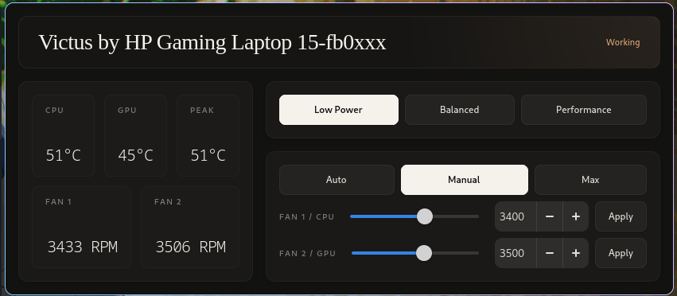

# Victus Control



Victus Control is a Linux-first control surface for HP Victus hardware written in Vala. This repo contains four binaries:

- `victus-control`: GTK4 monitor window
- `victus-tray`: GTK3 + Ayatana AppIndicator tray companion
- `victusd`: D-Bus helper exposing normalized hardware state and profile actions
- `victus-probe`: probe CLI for WMI/sysfs inventory and host snapshots

## Build

Install the required build dependencies first:

- Meson
- Ninja
- Vala (`valac`)
- `pkg-config`
- C compiler toolchain (`gcc`/`cc`)
- `glib-2.0`
- `gio-2.0`
- `gio-unix-2.0`
- `gobject-2.0`
- `gee-0.8`
- `json-glib-1.0`
- `gtk4`
- `gtk+-3.0`
- `ayatana-appindicator3-0.1`
- `polkit-gobject-1`

Then configure and compile:

```bash
meson setup build
meson compile -C build
```

## Installation

Install the released binary package from AUR:

```bash
yay -S victus-control-bin
```

Or clone the repo and run the local install/launch script:

```bash
./run-victus-control.sh
```

The script builds the project, installs the D-Bus/polkit assets, reloads the system bus, restarts the helper, and starts the tray companion plus monitor window.


## Current Behavior

- Reads DMI identity, hwmon temperatures, HP WMI hardware-profile state, and HP WMI inventory.
- Exposes HP WMI hardware-profile switching and a temperature-driven auto-policy mode in the helper.
- Exposes HP WMI hardware profiles through compact GTK controls and the tray menu.
- Exposes validated fan modes where available: `Auto`, `Manual`, and `Max`.
- Supports manual fan RPM targets through hp-wmi PWM/RPM sysfs controls when the kernel exposes them.
- Reapplies manual fan targets from the helper when firmware resets them.
- Shows separate tray readouts for temperature and fan RPM, with active profile/fan mode marked in the menu label.
- Keeps tray and GTK4 window as separate processes to avoid GTK3/GTK4 AppIndicator conflicts.

## Project Structure

```text
src/
├── common/              # Shared library
├── helper/              # System daemon
├── app/                 # GTK4 monitor window
│   ├── widgets/         # UI components
│   ├── style.css        # stylesheet
│   └── ...
├── tray/                # GTK3 system tray
└── probe/               # CLI probe tool
```

## Notes

- Fan and profile controls depend on the host kernel exposing compatible `hp_wmi` sysfs attributes.
- The tray companion requires a desktop session with a working StatusNotifier/AppIndicator host.
- The helper runs on the system bus and must be installed with the D-Bus service, D-Bus policy, and polkit policy files.
